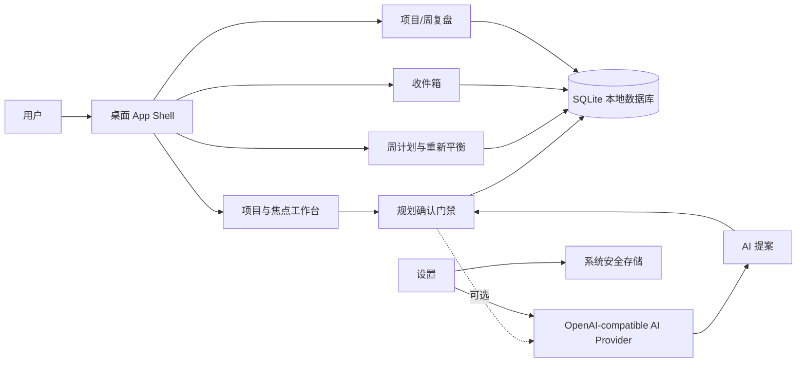

# VEYRA

一个面向长期目标的本地优先桌面规划工具：把模糊目标拆成阶段、里程碑与下一步行动，再用周计划和专注模式推动真实进展。

VEYRA 当前以 Flutter 桌面源码形式发布，包含可运行的 demo 数据、SQLite 本地持久化、可选的 OpenAI-compatible AI 接口，以及一套围绕“确认后再落库”的规划交互。

> 当前 showcase 版本暂不附 UI 截图：仓库内已有截图要么对应旧界面，要么包含字体/调试渲染问题。这里用可运行 demo、源码和 Mermaid 结构图作为可核验的产品证明。

## 它解决什么问题

传统待办清单擅长记录下一件小事，却很难帮助人从长期目标走到本周行动。VEYRA 把规划过程拆成几个可审阅的状态：先描述目标，再确认阶段与里程碑，最后选择要执行的任务；AI 只生成提案，用户决定是否采用。

适合希望在本机管理学习、求职、作品集或其他长期项目的人。项目数据默认保存在本机 SQLite 数据库，不需要内置云账号或后端服务。

## 可以做什么

- 在“项目”中创建目标、成果、阶段、里程碑和任务。
- 在项目焦点页查看 Progress Path、当前阶段与下一步行动。
- 将任务加入周计划，按本周容量执行并重新平衡。
- 使用收件箱捕捉想法，再转入项目或直接创建项目。
- 进入禅意专注模式，减少上下文切换。
- 通过 TXT、DOCX、PDF 导入规划材料，再经过确认门禁生成项目结构。
- 配置任意 OpenAI-compatible endpoint，用于蓝图、任务拆解、重规划和复盘；未配置 AI 时，核心本地规划仍可用。
- 在项目复盘和周复盘中记录“真正完成了什么”，而不只统计任务数量。

## 产品结构


上图是根据当前源码中的 App Shell、Feature 页面、AppServices/Drift 数据层和 AI Provider 关系绘制的结构图；Mermaid 版本保留在下方，便于审阅和修改。



## 快速开始

前置条件：Flutter 3.x / Dart 3.13+，以及 macOS 或 Windows 桌面开发环境。项目当前保留 macOS 与 Windows runner。

```bash
flutter pub get
flutter run -d macos
```

在 Windows 上可使用：

```bash
flutter run -d windows
```

首次启动时，空数据库会写入一组 demo 项目、任务和收件箱内容，方便直接浏览主要界面。默认数据库位置：

- macOS：`~/Library/Application Support/veyra/veyra.sqlite3`
- Windows：`%APPDATA%/veyra/veyra.sqlite3`

运行测试：

```bash
flutter test
```

## AI 配置与隐私边界

AI 是可选能力。在“设置”中填写 Base URL、Model 和 API Key 后，VEYRA 会向用户配置的 OpenAI-compatible endpoint 请求 JSON 规划结果。API Key 通过 `flutter_secure_storage` 写入 macOS Keychain / Windows 安全存储，不写入 SQLite；仓库不包含任何真实密钥。

使用 AI 功能时，目标描述、约束和导入文档内容会发送到用户配置的服务商。VEYRA 本身不提供内置云端同步或账号系统；本地数据库也不会自动上传。

## 技术选择

- Flutter / Dart：跨 macOS 与 Windows 的桌面 UI。
- Drift + SQLite：类型安全的本地数据层与版本迁移。
- `flutter_secure_storage`：API Key 安全存储。
- `http`：OpenAI-compatible provider 的网络请求。
- 纯 Dart 文档提取：TXT、DOCX、PDF 导入路径。
- Widget / unit / integration tests：覆盖 AI provider、数据仓储、核心页面与稳定性场景。

## Showcase 中包含什么

```text
lib/                    应用、领域模型、数据层、AI provider 与功能页面
test/                   公开的单元测试、widget 测试与功能测试
integration_test/       本地持久化与 AI 设置集成测试
macos/                  macOS runner 与应用配置
windows/                Windows runner 与应用配置
docs/                   产品需求与 UI 规格
DESIGN.md               视觉系统与设计约束
pubspec.yaml            依赖与运行时配置
pubspec.lock            已解析依赖版本
```

发布树特意不包含 `.git`、构建产物、Flutter ephemeral 文件、IDE 配置、日志、研究资料、开发截图 harness、API 调试脚本和本机数据库。

## 验证

以下命令已在白名单 staging 副本中执行：

```text
flutter pub get   ✓
flutter analyze   ✓ No issues found
flutter test      ✓ 118 tests passed
flutter build macos --debug   ✓ Built macOS app
```

测试输出包含 Drift 关于同一 QueryExecutor 创建多个数据库实例的 debug warning，但测试仍全部通过；这项提示应在后续工程维护中继续收敛。

## 当前边界

- 当前仓库是作品集源码发布，不提供预构建安装包或自动更新器。
- AI 能力依赖用户自行提供 endpoint、model 和 API key；不承诺任何特定供应商的可用性或价格。
- 视觉截图将在一次可复现且无调试错误的桌面运行验收后再单独加入。
- 当前没有附带开源许可证；如要允许他人复用，请在发布前选择并加入明确的 LICENSE。

## English summary

VEYRA is a local-first Flutter desktop planner for turning long-term goals into confirmed phases, milestones, weekly actions, and focused execution. It includes local SQLite persistence, optional OpenAI-compatible planning, document import, inbox capture, weekly replanning, review flows, and secure API-key storage. This showcase release publishes curated source and tests for macOS and Windows; it does not include build outputs, local databases, secrets, or unreliable screenshots.

## License

No license has been selected yet. All rights remain with the author until a LICENSE file is added.
