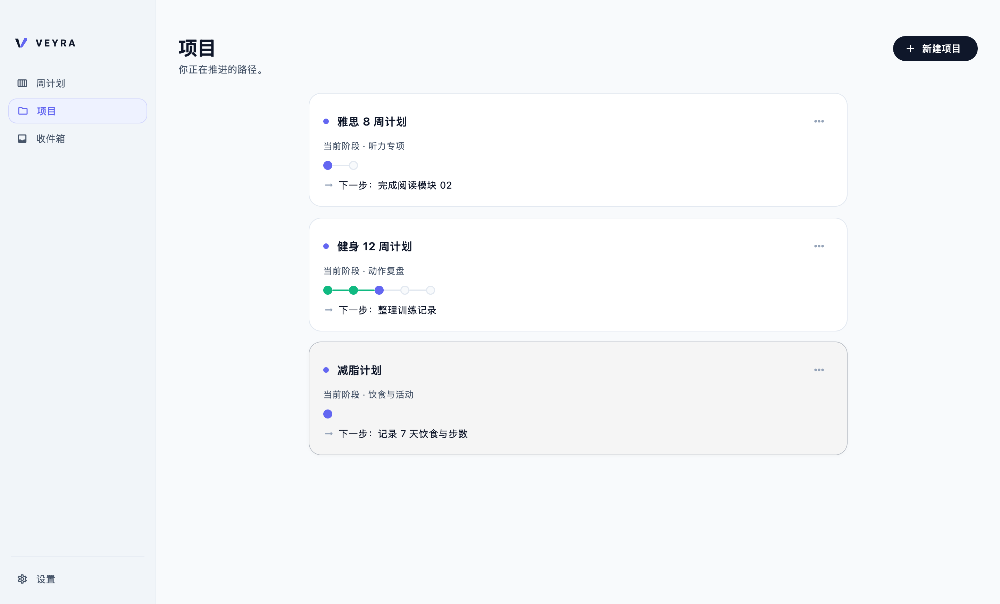
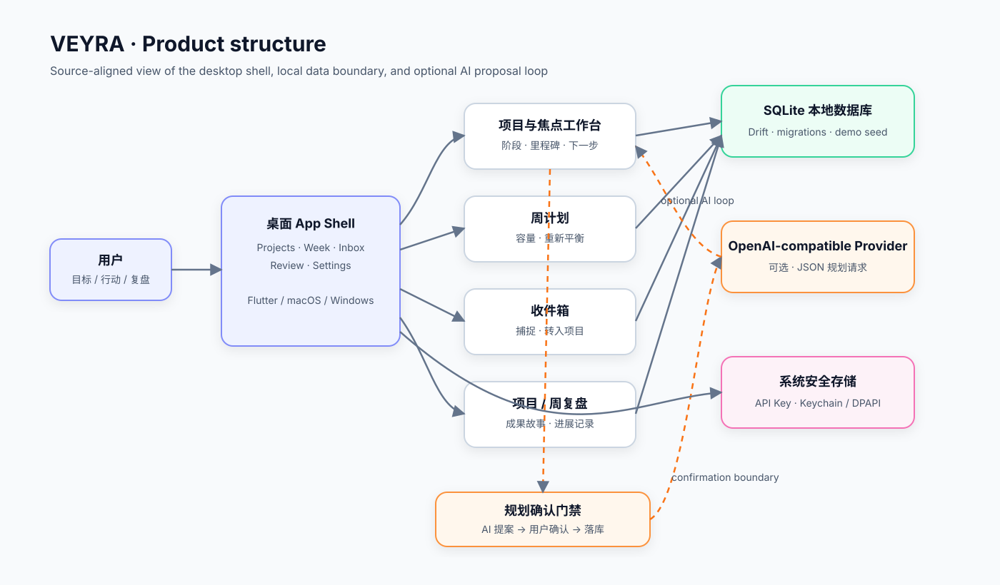
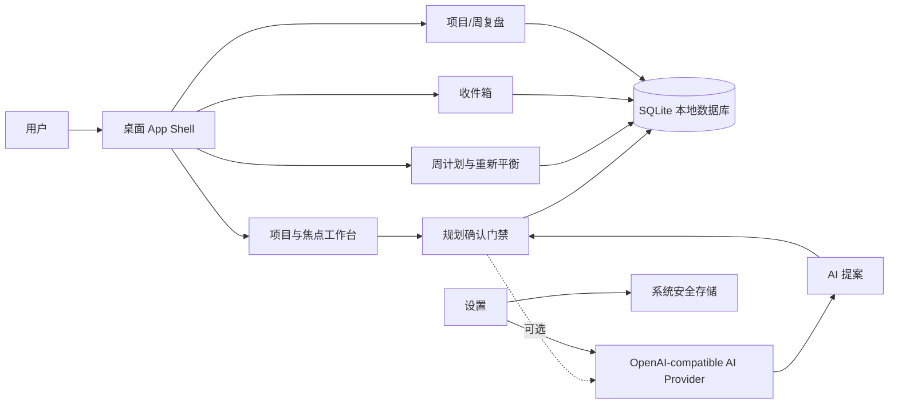

# VEYRA

VEYRA 是一个本地优先的 Flutter 桌面规划工具：把长期目标拆成阶段、里程碑和下一步行动，再用周计划与专注模式推动真实进展。

当前仓库只发布运行 VEYRA 所需的源码、测试、macOS/Windows runner，以及一张真实运行截图和一张源码对齐的结构图。



截图来自当前 macOS debug 构建，使用中性的 demo 数据（雅思、健身、减脂），不包含其他项目内容。

## 核心能力

- 项目、阶段、里程碑和任务管理。
- 周计划、容量调整、收件箱和专注模式。
- TXT、DOCX、PDF 规划材料导入。
- SQLite 本地持久化。
- 可选的 OpenAI-compatible AI provider：AI 只生成提案，用户确认后才写入数据。
- macOS Keychain / Windows 安全存储保存 API Key。

## 产品结构





## 快速开始

前置条件：Flutter 3.x / Dart 3.13+，以及 macOS 或 Windows 桌面开发环境。

```bash
flutter pub get
flutter run -d macos
```

Windows：

```bash
flutter run -d windows
```

运行测试：

```bash
flutter test
```

首次启动时，空数据库会写入一组 demo 项目、任务和收件箱内容。数据默认保存在本机 SQLite，不需要内置云账号或后端服务。

## AI 与隐私边界

AI 是可选能力。使用时，目标描述、约束和导入文档内容会发送到用户配置的 OpenAI-compatible endpoint。API Key 使用系统安全存储，不写入 SQLite；仓库不包含真实密钥。

## 发布内容

```text
lib/              应用源码、领域模型、数据层、AI provider 与功能页面
test/             单元、widget 与功能测试
integration_test/ 集成测试
macos/            macOS runner 与应用配置
windows/          Windows runner 与应用配置
docs/assets/      当前构建截图与结构图
pubspec.yaml      依赖与运行时配置
pubspec.lock      已解析依赖版本
README.md         项目说明
```

仓库刻意不包含其他项目资料、PRD/UI 内部文档、第三方声明、设计笔记、构建产物、Flutter ephemeral 文件、IDE 配置、日志、研究资料、截图 harness、本机数据库或密钥。

## 验证

发布前已在干净 staging 副本执行：

```text
flutter pub get             ✓
flutter analyze             ✓ No issues found
flutter test                ✓ 118 tests passed
flutter build macos --debug ✓ Built macOS app
```

## License

No license has been selected yet. All rights remain with the author until a LICENSE file is added.
