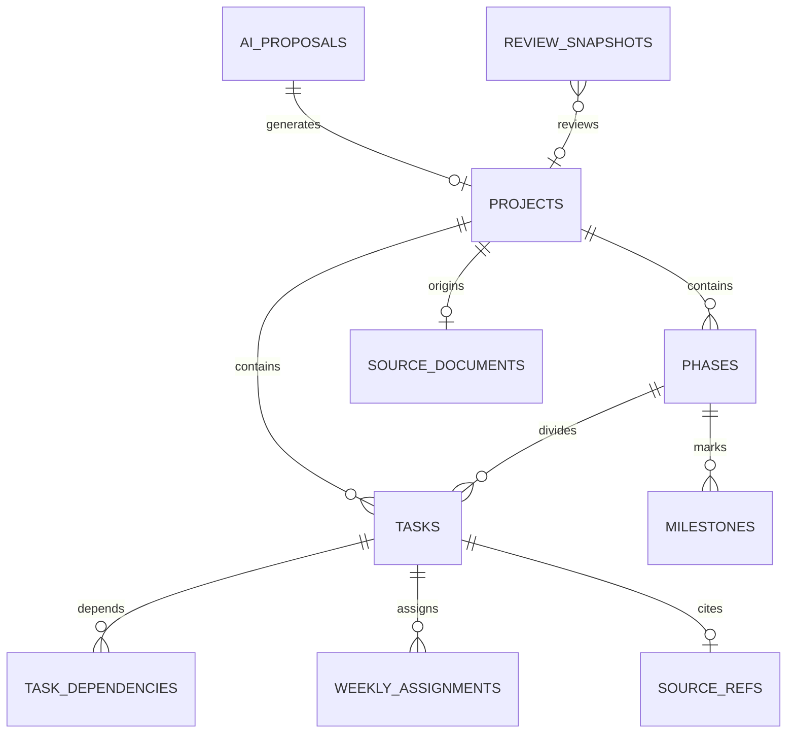
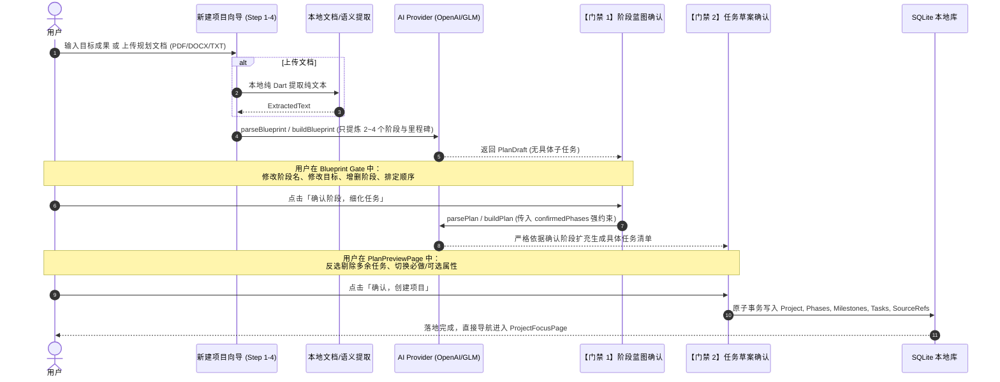

# VEYRA 产品需求文档 (Product Requirements Document)

**文档版本**：v2.0 (全量实现基线版)  
**最后更新**：2026-09-18  
**产品定位**：Local-first, Quiet, Focused, Minimal, Premium Desktop Productivity App  
**技术栈**：Flutter Desktop + Dart / macOS (主) + Windows (预留) / 本地 SQLite (Drift)

---

## 1. 产品愿景与设计哲学 (Product Vision & Principles)

### 1.1 核心愿景
现代生产力工具普遍存在三大顽疾：
1. **任务垃圾场化**：用户堆积数百条琐碎待办，充斥着刺眼的红色逾期（Overdue）标识与数字红点，引发强烈的精神内耗与焦虑；
2. **规划与执行脱节**：日历视图切割成小时碎片，而大目标的推进缺乏全景阶段感；
3. **AI 对话框化**：AI 被简单塞入侧边聊天气泡中，盲目幻觉、脱离上下文，缺乏可控性与确认环节。

**VEYRA** 重新定义桌面端个人生产力：
- **Quiet & Focused**：没有焦虑倒计时，没有红色逾期警告，没有任务红点。界面极度宁静、克制、优雅。
- **Local-first & Private**：数据 100% 留存在本机 SQLite；密钥存放于系统钥匙串；无需注册、无后端、无云同步。
- **Swiss Dopamine 质感**：融合瑞士国际主义平面排版的理性骨架（Crisp Canvas、精确间距、严谨字体层级）与微多巴胺色彩反馈（Things 3 触感反馈、Linear 精准度、发光呼吸微动效）。

### 1.2 核心公理与架构定式
1. **Project 是唯一 Source of Truth（真理源）**：
   所有的目标、阶段（Phases）、里程碑（Milestones）、任务（Tasks）以及前后置依赖均隶属于 Project。周视图（Week）只是可选的执行切片，不是独立的数据源。
2. **Week 是可选执行视图**：
   用于容纳本周重点推进的 2~5 个核心目标分组，杜绝无意义的任务堆积与小时级排程。
3. **AI 是嵌入式能力层，遵循严谨的提案门禁机制**：
   - 公式：`Intent / Document → Blueprint Gate (阶段对齐) → Preview Gate (任务微调) → Apply (原子落库)`
   - **AI 永远不直接写入或改动业务数据库**。
   - **AI 绝不作为一个独立的全局聊天机器人页面存在**。

---

## 2. 界面设计系统 (Design System: Swiss Dopamine)

### 2.1 调色板 (`VeyraColors`)
| 色彩类别 | 常量名 | 16进制色值 | 语义与场景 |
| :--- | :--- | :--- | :--- |
| **底色与画布** | `background` | `#F8FAFC` | 极浅冷灰主画布底色，消除眩光 |
| | `backgroundAlt`| `#F1F5F9` | 侧边栏及辅助区底色 |
| | `surface` | `#FFFFFF` | 卡片与弹窗纯白表面 |
| **文本与边框** | `textPrimary` | `#0F172A` | Slate 900，主标题与主要正文 |
| | `textSecondary`| `#475569` | Slate 600，次级描述与辅助文案 |
| | `textTertiary` | `#94A3B8` | Slate 400，占位符与微弱提示 |
| | `border` | `#E2E8F0` | 1px 标准分割线与卡片边框 |
| **多巴胺活力系** | `dopamineIris` | `#6366F1` | 电光鸢尾紫（默认主强调色 Accent） |
| | `dopamineMint` | `#10B981` | 霓虹薄荷绿（成功、达成、心流呼吸） |
| | `dopamineCoral`| `#F97316` | 晚霞活力橙（警示、关键注意点） |
| | `dopamineBerry`| `#EC4899` | 鲜嫩浆果粉（生存模式、高负荷警示） |
| | `dopamineCyan` | `#0EA5E9` | 晴空电光青（正向流计时、快速探索） |
| | `dopamineViolet`| `#8B5CF6`| 晶透极光紫（项目专属 Accent） |
| **状态胶囊** | `mustBg` / `mustText` | `#FEE2E2` / `#DC2626` | 「必做」高优先级微胶囊 |
| | `optionalBg` / `optionalText` | `#F1F5F9` / `#475569` | 「可选」优先级胶囊 |

### 2.2 间距与圆角阶梯
- **间距 (`VeyraSpacing`)**：`s2(2)`, `s4(4)`, `s6(6)`, `s8(8)`, `s10(10)`, `s12(12)`, `s14(14)`, `s16(16)`, `s20(20)`, `s24(24)`, `s32(32)`, `s40(40)`, `s48(48)`, `s64(64)`
- **圆角 (`VeyraRadius`)**：`small(8.0)`, `medium(12.0)`, `large(18.0)`, `xl(24.0)`, `full(999.0)`
- **阴影 (`VeyraShadows`)**：
  - `subtle`：`BoxShadow(color: 0x08000000, blur: 4, offset: (0, 1))`
  - `elevated`：`BoxShadow(color: 0x0E000000, blur: 12, offset: (0, 3))`

### 2.3 动效物理规范 (`VeyraMotion`)
- `instant` (100ms)：微按压、图标切换、复选框点击。
- `fast` (140ms)：Hover 高亮、Things 3 触感延迟完成。
- `standard` (200ms)：折叠面板展开、列表项进出、页面无位移淡入淡出（`VeyraFadeSwitcher`）。
- `emphasized` (260ms)：路由推入（淡入 + 垂直微升 8-10px `VeyraPageRoute`）。
- `progress` (340ms)：进度条流转、里程碑达成。
- **无障碍适配**：全量响应系统 `disableAnimations` / `Reduced Motion`，开启时自动降级为 `Duration.zero`。

### 2.4 特色交互原子组件
1. **`VeyraCheckbox`**：Things 3 风格圆环复选框（20px 外径，1.5px 描边，按压缩放 0.94，点击后 140ms 平滑触发划线置灰）。
2. **`ProgressPath`**：水平串联节点指示器，用离散阶段的连线节点取代冰冷的百分比进度条。
3. **`VeyraPressable`**：桌面原生交互包装（Hover 上浮 1.5px、Press 缩放 0.99、键盘 Tab 聚焦呈现 Iris 外发光外环）。
4. **`VeyraAppBar`**：严格适配 macOS 全沉浸式窗口，内置 `84px` 左侧留白（Safe Zone），彻底避免遮挡系统红黄绿交通灯。

---

## 3. 领域模型与本地数据库设计 (Domain & Database Architecture)

- **存储引擎**：SQLite 3 + Drift ORM
- **Schema 版本**：`v2`（支持单调递增安全迁移，禁止运行时 Drop 表）
- **文件存储路径**：
  - macOS: `~/Library/Application Support/veyra/veyra.sqlite3`
  - Windows: `%APPDATA%/veyra/veyra.sqlite3`



### 3.1 核心数据表详述（共 14 张表）

| 表名 (Table) | 实体类 (Entity) | 核心字段定义与约束 | 业务逻辑与规则 |
| :--- | :--- | :--- | :--- |
| **`Projects`** | `Project` | `id` (PK, 自增)<br>`title` (1..200 字符)<br>`outcome` (交付成果目标)<br>`executionMode` (`projectOnly` / `weeklyPlanning`)<br>`status` (`active`, `paused`, `completed`, `archived`)<br>`health` (`onTrack`, `needsAttention`, `atRisk`)<br>`startDate`, `deadline`<br>`themeColor` (ARGB 32位整型)<br>`sourceDocumentId` (FK) | 项目是核心源头。当 `executionMode` 从 `weeklyPlanning` 切换为 `projectOnly` 时，自动级联删除该项目的所有 `WeeklyAssignments`。 |
| **`Phases`** | `Phase` | `id` (PK, 自增)<br>`projectId` (FK)<br>`title`<br>`goal` (阶段交付说明)<br>`orderIndex` (排序序号) | 项目的宏观攻坚阶段（通常 2~4 个）。每个 Phase 拥有独立的里程碑与任务。 |
| **`Milestones`** | `Milestone` | `id` (PK, 自增)<br>`projectId` (FK)<br>`phaseId` (FK)<br>`title`<br>`orderIndex`<br>`completedAt` (可空) | 阶段内的关键路标。`completedAt != null` 即为达成，触发成果复盘记录。 |
| **`Tasks`** | `Task` | `id` (PK, 自增)<br>`projectId` (FK)<br>`phaseId` (FK)<br>`milestoneId` (可空 FK)<br>`title`<br>`description`<br>`status` (`planned`, `active`, `completed`, `deferred`, `skipped`)<br>`priority` (`must`, `optional`)<br>`effort` (`small`, `medium`, `large`)<br>`dueDate`<br>`outcomeNote` (交付产物备注)<br>`orderIndex` | 具体执行行动。删除任务前必须检查依赖关系，若被其它未完成任务依赖则抛出 `StateError` 阻止误删。 |
| **`TaskDependencies`** | `TaskDependency`| `id` (PK)<br>`taskId` (FK)<br>`dependsOnTaskId` (FK) | 明确任务的先后前置依赖关系，辅助推进计算。 |
| **`SourceRefs`** | `SourceRef` | `id` (PK)<br>`kind` (`userQuote`, `document`, `aiReason`)<br>`quote` (原文片段)<br>`aiReason` (AI 生成依据)<br>`documentId` (可空 FK) | AI 计划生成时的溯源锚点，保证每一条被拆解的任务都“有据可查”。 |
| **`WeekSettings`** | `WeekSetting` | `id` (PK)<br>`weekStart` (唯一索引，归一化至周一 00:00)<br>`capacity` (`relaxed`, `normal`, `busy`, `survival`) | 周容量设定（轻松/正常/忙碌/生存模式），调控本周负荷认知。 |
| **`WeeklyAssignments`**| `WeeklyAssignment`| `id` (PK)<br>`weekStart` (周一 00:00)<br>`taskId` (FK)<br>`projectId` (FK)<br>`addedAt` | 周任务映射桥接表。若任务所属项目模式为 `projectOnly`，系统拒绝加入。 |
| **`InboxItems`** | `InboxItem` | `id` (PK)<br>`kind` (`quickTask`, `idea`, `file`, `newGoal`)<br>`content`<br>`filePath`<br>`status` (`open`, `converted`, `archived`) | 临时灵感与突发待办的暂存缓冲区。可一键转换为项目任务或直接立项。 |
| **`SourceDocuments`** | `SourceDocument` | `id` (PK)<br>`fileName`<br>`fileKind` (pdf/docx/txt/md)<br>`filePath`<br>`extractedText`<br>`importedAt` | 本地导入的原始文档及提取纯文本存档。 |
| **`AiProposals`** | `AIProposal` | `id` (PK)<br>`kind` (`plan`, `rebalance`, `review`)<br>`status` (`draft`, `accepted`, `partiallyAccepted`, `rejected`)<br>`payloadJson`<br>`summary`<br>`decidedAt` | AI 阶段提炼、任务拆解与重平衡的草案缓冲区。用户确认前绝不入业务表。 |
| **`ProgressEvents`** | `ProgressEvent` | `id` (PK)<br>`type` (`taskCompleted`, `milestoneCompleted`, `proposalApplied`, etc.)<br>`projectId`, `taskId`<br>`detail`<br>`occurredAt` | 审计与轨迹时间轴事件流，作为周复盘与项目复盘的事实依据。 |
| **`ReviewSnapshots`** | `ReviewSnapshot`| `id` (PK)<br>`scope` (`week`, `project`)<br>`targetId`<br>`periodStart`, `periodEnd`<br>`storyJson`<br>`aiSummary` | 复盘历史快照。永久保存已结项或已结束周的 AI 提炼成果故事。 |
| **`Settings`** | `Settings` | `key` (PK), `value` | 存储非敏感偏好（如 `ai.baseUrl`, `ai.model`）。API Key 强制存入 Keychain。 |

---

## 4. 全局导航架构与外壳 (App Shell & Navigation)

### 4.1 桌面双栏架构 (`_HomeShell`)
- **左侧侧边栏 (`_VeyraSidebar`)**：
  - 固定宽度 `224px`，背景色 `VeyraColors.backgroundAlt` (`#F1F5F9`)。
  - 顶部内边距 `fromLTRB(20, 52, 20, 20)`（顶层预留 52px 避让 macOS 全沉浸交通灯）。
  - 展示品牌微标 `VeyraLogo` (形态：`zenithVector` 顶峰动量) + `VEYRA` 字标。
  - 3 个主目的地：
    1. **周计划** (`WeekPage`，`Icons.calendar_view_week_rounded`)
    2. **项目** (`ProjectsPage`，`Icons.folder_outlined`，**默认启动落脚点**)
    3. **收件箱** (`InboxPage`，`Icons.inbox_rounded`)
  - 杜绝红点与数字角标，保持注意力平静。
  - 底部：1px 分割线 + 「设置」入口 (`Icons.settings_outlined`)。
- **右侧主视图**：
  - 采用 `VeyraFadeSwitcher` 实现 200ms 的平滑交叉淡入淡出，彻底消除界面跳闪。

### 4.2 导航流转拓扑
```
HomeShell (224px 侧边栏)
 │
 ├── [1] 周计划 (WeekPage)
 │     ├── 重新平衡 ──────> RebalancePreviewPage (差异门禁) ──> 应用并返回
 │     ├── 本周复盘 ──────> WeekReviewPage (成果提炼)
 │     └── 任务行悬停 ────> ZenFocusPage (全屏专注)
 │
 ├── [2] 项目 (ProjectsPage) [默认]
 │     ├── 新建项目 ──────> NewProjectFlowDialog (阶段对齐门禁)
 │     │                     └── 细化任务 ──> PlanPreviewPage (任务挑选门禁) ──> 确认落库
 │     └── 点击卡片 ──────> ProjectFocusPage (单项目聚焦工作台)
 │                           ├── 查看完整规划 ──> ProjectPlanPage (全量编辑)
 │                           ├── 进入禅意专注 ──> ZenFocusPage (全屏专注)
 │                           └── 项目复盘 ────> ProjectReviewPage
 │
 ├── [3] 收件箱 (InboxPage)
 │     ├── 快速捕捉 (Quick Capture)
 │     ├── 移入项目 ──────> 选取项目并转为任务
 │     └── 创建为项目 ────> 直接立项
 │
 └── [*] 设置 (SettingsPage) [侧边栏底部 / 快捷入口]
       ├── AI 接口与模型配置 (BaseURL / Model / API Key)
       └── 本地数据路径与隐私合规展示
```

---

## 5. 核心功能模块规格说明 (Detailed Feature Specifications)

---

### 5.1 项目列表 (Projects List)
- **定位**：呈现“你正在推进的路径”，而非琐碎待办的堆砌。
- **页面布局**：
  - 自适应居中宽度：`<1200px: 760px`，`<1600px: 840px`，`>=1600px: 920px`。
  - 标题：「项目」；副标题：「你正在推进的路径。」；右上角主操作按钮：「+ 新建项目」。
  - 骨架屏：首屏加载采用灰调平滑骨架块，禁用突兀的全局菊花旋转。
- **项目卡片 (`_ProjectCard`)**：
  - 左侧：项目 Accent 主题色圆点。
  - 顶部：项目标题与更多操作菜单（归档 / 取消归档）。
  - 中部：当前进行阶段提示（`当前阶段 · [PhaseTitle]`）+ 极简路径指示器（`ProgressPath` 连线节点）。
  - 下部：智能计算的**下一步行动**（基于必做优先 + 截止期优先的推进算法：`下一步：[TaskTitle]`）。
- **已归档区**：通过 `VeyraExpandable` 实现的超轻量折叠面板，点击平滑展开历史归档项目。

---

### 5.2 项目焦点工作台 (Project Focus)
- **定位**：单个项目的推进中枢，仅暴露当前阶段最相关的行动。
- **UI 结构**：
  1. **项目 Hero 卡片**：
     - 大标题 + 预期交付成果（带瞄准靶心图标 `Icons.track_changes_rounded`）。
     - 状态徽标排：执行模式（每周推进 / 独立项目） + 健康度（正常推进 / 需关注 / 延期风险）。
     - 全横贯阶段轨迹（`ProgressPath`，标明各阶段完成态与当前攻坚点）。
     - 右上角跳转胶囊：「查看完整规划 →」。
  2. **当前阶段卡片 (`_CurrentPhaseCard`)**：
     - 多巴胺微背景（`dopamineCardBg` `#F5F6FF`）。
     - 阶段目标详细解析，帮助建立当前阶段的上下文心智。
  3. **「接下来」行动列表**：
     - 标题行：展示待办项数，右侧提供 **「进入禅意专注」** 显式胶囊按钮 (`Icons.self_improvement_rounded`)。
     - 任务行：Things 3 触感圆环复选框、任务名、必做/可选徽标、工作量胶囊。
     - **Hover 隐现专注**：鼠标移动至任一未完成任务行，右侧隐现专属专注微按钮，一键将当前任务作为队列首项拉起专注。
  4. **里程碑概览**：流式展示本阶段内的里程碑，以旗帜/奖杯图标标记达成状况。
  5. **顶部 AppBar**：内置 macOS 交通灯安全避让，右上角集成「项目复盘」入口。

---

### 5.3 完整规划与拆解维护 (Project Plan)
- **定位**：全量结构维护视图，供用户手动重构或微调由 AI/自己创建的完整工程。
- **核心能力**：
  - 查看全部阶段（Phase 01, Phase 02 ...）及其独立进度徽标（如 `3/5 完成`）。
  - 阶段卡片内自由添加任务（`+ 新建任务`）、添加里程碑（`+ 旗帜里程碑`）。
  - 支持直接勾选/反选任务状态。

---

### 5.4 统一 AI 规划流（两阶段确认门禁）
> **用户核心痛点解决**：彻底消除“我还没说具体怎么做，AI 就乱规划了一堆垃圾任务”的失控感。



#### 关键约束规范：
1. **第一阶段：战略蓝图生成 (`parseBlueprint` / `buildBlueprint`)**：
   - 提取 2~4 个核心攻坚阶段及里程碑。
   - 禁止在此阶段生成琐碎 tasks，避免注意力载荷过载。
2. **第一门禁：阶段架构确认 (`_NewProjectStep.aiBlueprint`)**：
   - 用户可直接在界面上对阶段标题、阶段目标进行内联编辑（`TextFormField`）。
   - 允许点击「添加阶段」或垃圾桶图标删除阶段。
3. **第二阶段：受限任务细化 (`parsePlan` / `buildPlan`)**：
   - Prompt 注入：`confirmedPhases` 作为强制性骨架。AI **被严格禁止自行增减阶段**，必须将子任务精确归入用户审定的阶段之下。
4. **第二门禁：任务草案交互式过滤 (`PlanPreviewPage`)**：
   - 未落库前呈现完整任务树。
   - 复选框支持反选（未选任务划删除线、半透明置灰，创建时不予持久化）。
   - 支持一键切换「必做 (Must)」与「可选 (Optional)」。
   - 包含原文引用片段溯源徽章（`来源：[原文片段]`）。

---

### 5.5 禅意专注心流 (Zen Focus Mode)
- **定位**：极简多巴胺沉浸式心流环境，消除一切外部视窗与侧边栏干扰。
- **页面设计与安全区**：
  - 全屏沉浸式 Scaffold（背景 `#F8FAFC`）。
  - **macOS 交通灯安全避让**：顶部 Header 左侧设置 `84.0px` 边距，标题采用 `Flexible` + `TextOverflow.ellipsis`，**永不重叠红黄绿窗口按钮**。
  - 右侧提供明显的「退出专注 (Esc)」入口。

```
+-----------------------------------------------------------------------+
|  [Traffic Lights Safe 84px]  雅思 7+ 攻坚 · Phase 1     [25m|5m|正向]    (Esc) |
|                                                                       |
|                     ┌───────────────────────────────┐                 |
|                     │  当前攻坚目标 (4 项待办)       │                 |
|                     │  完成剑桥听力 Section 3 泛听精练 │                 |
|                     └───────────────────────────────┘                 |
|                                                                       |
|                                  ╭───╮                                |
|                                ╭─╯   ╰─╮                              |
|                                │ 24:32 │   (4000ms 舒缓生理呼吸光晕)     |
|                                ╰─╮   ╭─╯                              |
|                                  ╰───╯                                |
|                                                                       |
|                          [↺ 重置]  [ 暂停 (Space) ]  [+5分钟]           |
|                                                                       |
|                 ┌───────────────────────────────────────┐             |
|                 │   ○  标记任务已达成 (⌘ + Enter)        │             |
|                 └───────────────────────────────────────┘             |
+-----------------------------------------------------------------------+
```

- **禅意呼吸光晕环 (`ZenBreathingRing`)**：
  - 基于 Canvas `CustomPainter` 高性能绘制。
  - **4000ms 心脏共振呼吸周期**（2s 舒缓吸气微扩，2s 呼气微敛），正弦波柔和光晕（Sinusoidal Breathing Aura）。
  - 环形进度条采用 `SweepGradient`（Iris 电光紫 -> Mint 霓虹绿）流光渐变，带有前端发光小球。
  - 中心展示 `46px` 纯等宽数字（Tabular Figures）倒计时与心流状态微胶囊。
- **三种专注模式**：
  1. `25m 专注`：经典番茄节律倒计时。
  2. `5m 休息`：番茄间歇放松。
  3. `正向流`：正向累加计时，适合开放式深度攻坚。
- **任务推进流与快捷键**：
  - `Space`：暂停 / 继续计时。
  - `+5 分钟`：快捷无感加时。
  - `⌘ + Enter`：触发 Things 3 风格圆环打勾动效，伴随 900ms 触感缓冲，自动无缝切换队列中的下一个任务。
  - 全部任务达成后自动呈现**圆满达成庆祝视图**（赞赏文案「心流圆满完成」+ 绿色达成徽章）。

---

### 5.6 本周规划与容量控制 (Week Page)
- **定位**：Sunsama 风格的周重点目标视图，拒绝碎片化任务堆叠。
- **核心组件**：
  1. **容量状态条 (`_CapacitySegmentedBar`)**：
     - 四级多巴胺分段控制器：
       - `轻松 (Relaxed)`：Mint 绿
       - `正常 (Normal)`：Iris 蓝紫
       - `忙碌 (Busy)`：Coral 橙
       - `生存模式 (Survival)`：Berry 莓红（高负荷心理保护）
     - 状态提炼文案：「推进 X 个重点项目 · Y 项任务」。
  2. **项目目标分组卡 (`_GoalCard`)**：
     - 每个加入周规划的项目生成独立的 Goal Card，限制只呈现 2~5 个关键行动。
     - 单任务支持 Things 3 勾选、悬停「禅意专注」直达、一键移出本周（`移至下周`）。
  3. **动态重平衡入口 (`重新平衡`)**：
     - 当突发事件打乱节奏时，点击弹出重平衡对话框，输入现状情景（如“本周临时出差两天，周四前无法使用电脑”）。
     - 调用 `ReplannerService.proposeChanges` 生成差异提案，推进至 `RebalancePreviewPage`。

---

### 5.7 重规划差异门禁 (Rebalance Preview)
- **定位**：只展示受影响的变动项（Diff-only），保护用户心智。
- **变动卡片 (`_ChangeCard`)**：
  - 变动类型徽标：`移动`（移至下周）、`优先级`（必做/可选互转）、`新增`、`顺延`。
  - 转变清晰呈现：`原状态 → 新状态`（如：`可选 → 必做` 绿色高亮标注）。
  - AI 给出的调整原因说明。
- **操作门禁**：
  - 支持按条目 Checkbox 单独勾选，点击「应用所选」或「全部应用」。
  - 仅在点击确认后，批量更新 `WeeklyAssignments` 与 `Tasks` 表。

---

### 5.8 成果导向复盘 (Week & Project Review)
- **定位**：“成果优先，任务数量只是次要信息”。
- **展示骨架 (`_ReviewBody`)**：
  - 顶部：AI 生成的一句话成果精炼综述。
  - **核心成果亮点（「你真正完成了」）**：优先提取已完成任务中的产物记录（`task.outcomeNote`），以实名绿色徽章呈现。
  - **里程碑达成（「达成的里程碑」）**：奖杯图标罗列本周期攻克的重大里程碑。
  - **推迟事项（「被推迟的」）**：客观呈现顺延事项，不带负面谴责情绪。
  - 底部极简小字：「共完成 X 项任务」。

---

### 5.9 收件箱 (Inbox)
- **定位**：“先把事情放下来，之后再决定”。
- **UI 特性**：
  - 顶部 **Quick Capture** 快速输入栏，回车即存。
  - 列表无沉重卡片边框，鼠标悬停行隐现幽灵操作按钮：
    - `移入项目`：选择项目后自动在首个阶段创建任务，收件箱条目置为 `converted`。
    - `创建为项目`：直接以收件箱文字命名立项。
    - `归档` / `删除`（二次确认弹窗）。

---

### 5.10 设置与本地合规 (Settings)
- **AI 服务配置**：
  - Base URL（支持 OpenAI、智谱 GLM、DeepSeek、Ollama 等任意 OpenAI 兼容地址）。
  - Model 选单（预置 `glm-4-flash (智谱免费)`、`glm-4`、`gpt-4o-mini` 快捷芯片）。
  - API Key 密码框：使用操作系统原生钥匙串（macOS Keychain / Windows DPAPI）加密存储，绝不落地明文数据库。
  - 「测试连接」按钮：即时发起轻量探测，验证连通性。
- **本地数据透明度**：
  - 显示当前 SQLite 数据库物理绝对路径。
  - 明确标示隐私承诺：「所有数据保存在本机，VEYRA 不上传任何内容。」

---

### 5.11 本地纯 Dart 文档提取引擎 (Document Import Engine)
- **定位**：100% 离线、纯 Dart 实现的文档文本解析管道，严禁依赖系统级命令行工具或网络第三方 OCR。
- **支持格式与技术实现**：
  1. **TXT / Markdown** (`TextLikeExtractor`)：支持 `.txt`, `.md`, `.markdown`。内置字节探测器，自动兼容识别 UTF-8 与 GBK 编码。
  2. **DOCX** (`DocxExtractor`)：基于纯 Dart `archive` 库解压 `word/document.xml`，通过正则表达式精准抓取全部 `<w:t>` 文本节点并按段落拼接。
  3. **PDF** (`PdfExtractor`)：纯 Dart 流扫描，识别 PDF xref 目录与压缩文本流，经 zlib 解压后提取 `Tj` / `TJ` 文本算子。对图片扫描件或加密 PDF 给出温和的用户提示，保障应用不出现未捕获异常。

---

## 6. AI 契约接口与容错规范 (AI Provider Architecture)

### 6.1 接口定义 (`AIProvider`)
```dart
abstract class AIProvider {
  // 第一阶段：提取战略阶段架构（无具体子任务）
  Future<PlanDraft> buildBlueprint(AIBuildPlanRequest request);
  Future<PlanDraft> parseBlueprint(AIParsePlanRequest request);

  // 第二阶段：受限于用户确认的 phases，细化具体 tasks
  Future<PlanDraft> buildPlan(AIBuildPlanRequest request);
  Future<PlanDraft> parsePlan(AIParsePlanRequest request);

  // 动态重平衡与复盘
  Future<RebalanceProposal> proposeRebalance(AIRebalanceRequest request);
  Future<AIReviewSummary> generateReview(AIReviewRequest request);
  Future<bool> testConnection();
}
```

### 6.2 防御性 JSON 解析与异常继承树
大模型输出强制声明 `response_format: { type: "json_object" }`。针对网络抖动、模型幻觉、格式残缺定义了完善的异常继承树：
```
AIException (基类)
 ├── AINotConfiguredException (未填 API Key / BaseURL)
 ├── AIAuthException (401 / 403 鉴权失败)
 ├── AIRateLimitException (429 频次限制)
 ├── AIFormatException (JSON 残缺或字段校验失败，防止污染本地库)
 └── AINetworkException (DNS 失败 / 超时)
```
- **未配置全局拦截**：UI 层拦截未配置异常，通过 `showAiNotConfigured` 弹出统一 SnackBar，提供「立即配置」按钮直达设置页。

---

## 7. 非功能性需求与质量保障 (NFR & Verification)

1. **性能与渲染**：
   - 桌面 60fps / 120fps (ProMotion) 流畅渲染，呼吸环与计时器使用 `Canvas.drawArc` 与等宽字体，避免布局重新测量（Re-layout）。
   - 数据库操作全部在后台异步执行或轻量事务内提交。
2. **测试覆盖率**：
   - 包含完整的离线测试矩阵：全自动化测试套件 **120 / 120 全部通过**（`flutter test` 100% Green）。
   - 包含 `document_blueprint_flow_test.dart`（验证两阶段蓝图门禁流）、`zen_focus_test.dart`（验证呼吸环、快捷键、任务队列推进）。
3. **代码健康度**：
   - `flutter analyze` 严格 0 Warning / 0 Error。
4. **跨平台兼容储备**：
   - 核心代码解耦 macOS 专有依赖；路径处理使用 `path_provider`；Windows 窗口适配保留扩展点。

---

## 8. 核心业务验收路径清单

| 验收场景 | 触发方式 | 期望行为与门禁表现 |
| :--- | :--- | :--- |
| **场景 1：目标新建两阶段门禁** | 点击「新建项目」→ 选择「让 VEYRA 帮我规划」→ 输入目标 | 1. 弹出 Blueprint 界面，只展示 2~4 个阶段；<br>2. 用户可编辑阶段名，点击下一步；<br>3. 弹出 PlanPreviewPage，勾选剔除多余任务后点击确认；<br>4. 成功创建并进入项目焦点页。 |
| **场景 2：文档导入规划** | 点击「新建项目」→ 上传 DOCX/PDF/MD 文件 | 1. 本地纯 Dart 提取文本；<br>2. 提炼阶段进入 Blueprint 门禁；<br>3. 确认阶段后生成带原文引用的任务草案；<br>4. 确认后落库。 |
| **场景 3：禅意心流极简专注** | 在项目焦点页点击「进入禅意专注」或单任务悬停点击 | 1. 全屏沉浸式展开，顶部左侧留白 84px 避让红绿灯；<br>2. 4000ms 舒缓生理呼吸环流光转动；<br>3. 按 Space 暂停/继续，按 ⌘+Enter 标记完成并切入下一任务；<br>4. 全部做完后展示庆祝画面。 |
| **场景 4：周动态重平衡** | 在周计划页面点击「重新平衡」→ 输入突发情况 | 1. AI 计算差异变动；<br>2. 弹出 RebalancePreviewPage 仅呈现 Diff 卡片；<br>3. 勾选需要应用的条目，点击「应用所选」后局部更新本周任务。 |
